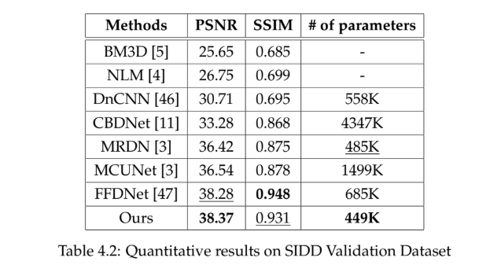
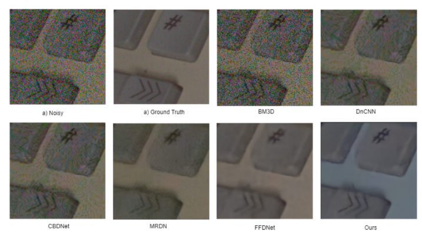

# Multi-Patch Hierarchical Network with Non-Local Information for Real-World Image Denoising

## 🔍 Highlights

- **Lightweight:** The model is highly efficient, with a total size of approximately **22.5 MB**.
- **Fast:** Capable of processing HD images in just **0.018 seconds** on average, supporting **real-time video denoising**.

---

## 📂 Dataset

We use the **SIDD (Smartphone Image Denoising Dataset)** benchmark to evaluate our denoising approach, particularly the **SIDD Small Dataset** for training and validation.

- **Training Set:**  
  Contains **102,518 noisy-clean image pairs** of size **120×160**, extracted via patching high-resolution images.

- **Validation Set:**  
  Includes **1,280 image pairs** of size **256×256**, with diverse lighting conditions and ISO settings to simulate real-world noise.

### 📥 Download Instructions

1. **Training Dataset:**  
   Download from the official SIDD page:  
   [🔗 SIDD Small Dataset (SIDD_Small_sRGB_Only.zip ~6.4 GB)](https://abdokamel.github.io/sidd/)

2. **Validation Dataset:**  
   Download from Kaggle:  
   [🔗 SIDD Validation Dataset](https://www.kaggle.com/datasets/kashingwong/sidd-val?resource=download)  
   - Download the files:
     - `ValidationNoisyBlocksSrgb.mat`
     - `ValidationGtBlocksSrgb.mat`

---

## 🏃 Running the Code

To train the model, follow these steps:

1. Upload the following files to your **Google Drive**:
   - `SIDD_Small_sRGB_Only.zip`
   - `ValidationNoisyBlocksSrgb.mat`
   - `ValidationGtBlocksSrgb.mat`

2. Run the Jupyter Notebook:  
   📓 `Image_Denoising_Using_Multipatch_Hierarchical_Network.ipynb`

---

## 📊 Quantitative Results

---

## 🖼️ Qualitative Results

---
